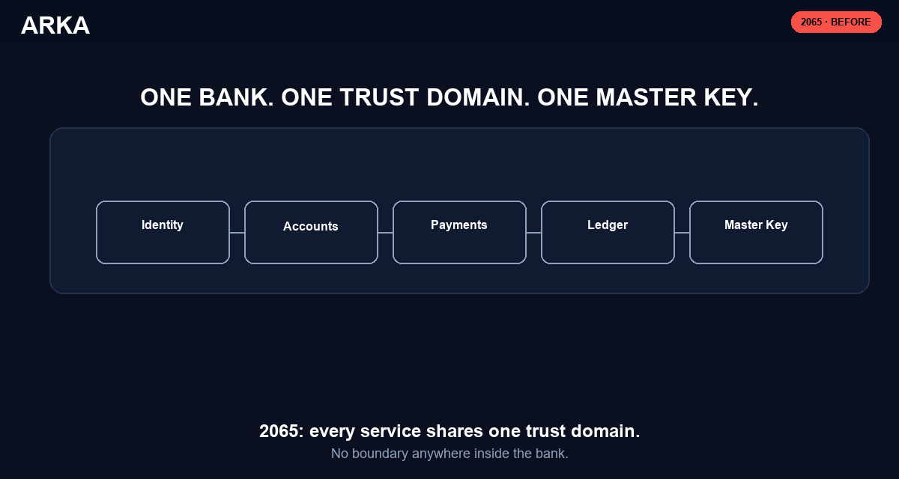
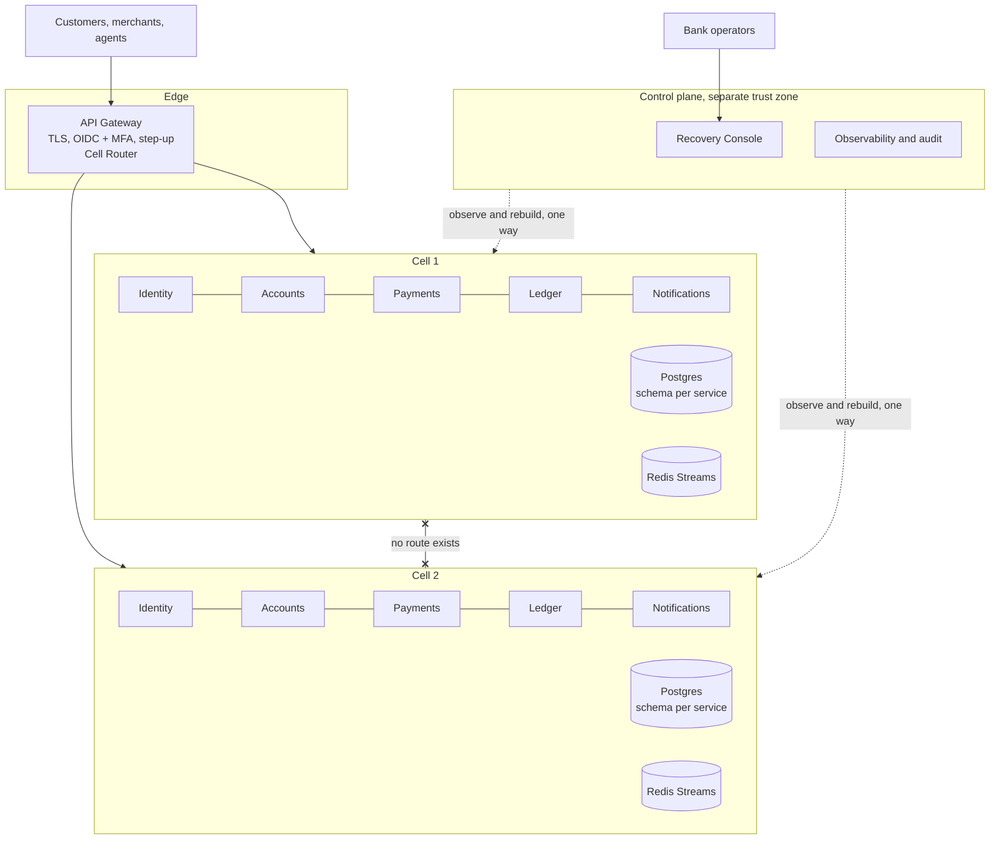

# Arka

**Banking that survives.** A cell-isolated digital banking platform, built for Duothan 6.0 by Team
True Node, NSBM Green University.

## The problem

The 2065 collapse in the competition scenario was not a security failure. It was an architecture
failure. Banking systems shared one trust domain, one network, and one Master Key, so a single
compromise became total compromise. Customer data survived in backups. Operations did not, because
recovery was never designed.

Arka rebuilds digital banking so that class of disaster is structurally impossible.



## Three doctrines

**Assume breach.** Every service-to-service call carries a short-lived workload identity. A process
that cannot prove what it is talks to nothing. This removes the lateral movement that turned one
foothold into a global outage.

**Contain by construction.** Customers are sharded across independent Cells. Each Cell runs the full
service stack with its own databases. Cells share nothing and have no network path to each other. A
compromise is capped at one Cell while every other Cell keeps serving, unaware anything happened.
Blast radius stops being luck and becomes a design parameter.

**Recovery is a feature.** The ledger is an append-only chain of double-entry records, each block
carrying the hash of its predecessor. Tampering is detectable by mathematics, not by trust. State
rebuilds by replay. And there is no Master Key: root recovery requires a 3-of-5 quorum of independent
keyholders, so there is no single artifact to steal, ransom, or lose.

## Architecture



The important detail is the crossed link between Cell 1 and Cell 2. There is no route between them,
so nothing that compromises one can reach the other. The control plane observes and rebuilds Cells
through a one-way channel, holds no customer data, and accepts no instructions from the Cells.

**A Cell is configuration, not code.** There is exactly one copy of each service. A Cell is that
service deployed with a different environment:

```
CELL_ID=cell-1
DATABASE_URL=<cell-1 postgres>
REDIS_URL=<cell-1 redis>
LEDGER_SIGNING_KEY=<cell-1 key>
```

This is what makes the isolation claim provable rather than asserted. Cell 1 holds no credential that
can reach Cell 2, and adding Cell 3 is a config file, not a code change.

Live against the real running stack, not staged: `docker exec`-ing from Cell 1's own container into
Cell 2 fails on DNS resolution, because the two Cells share no network at all, then `pnpm verify-ledger`
walks both Cells' real hash chains.


## Containing a real incident

FR-22: an operator quarantines a Cell under dual approval (two distinct operators, neither alone), and
every write against it is rejected while every read still succeeds, read-only, not down. This is the
exact HTTP traffic, recorded live, no staging: a transfer succeeds, the Cell is quarantined, the
identical transfer is rejected `403 CELL_QUARANTINED`, the dashboard still reads fine, the quarantine is
lifted, and the transfer succeeds again.


See [docs/media/README.md](docs/media/README.md) for how these were recorded and how to reproduce them.

## Quickstart

This path was verified end to end on a fresh clone. Follow it in order.

**Prerequisites.** Docker Desktop or Docker Engine with Compose v2. Node **22 or later**, which the
root `package.json` enforces, so Node 20 fails at install. pnpm 11 or later, most easily via
`corepack enable`. Ports 3000, 3001, 3002, 3300, 8080, 5433, 5434, 5435, 6380 and 6381 free.

```bash
git clone <repo-url> arka && cd arka
pnpm install
cp .env.example .env
docker compose up -d --wait   # two full Cells, --wait blocks until every healthcheck passes
pnpm seed                     # deterministic demo data
pnpm dev                      # all five apps
```

`--wait` matters. Without it Compose returns as soon as the containers start, and `pnpm seed` can
reach Postgres before it is accepting connections.

You should see, from `pnpm seed`:

```
cell-1: seeded 15 blocks (customer:alice, customer:bob, agent:west, merchant:kade)
cell-2: seeded 14 blocks (customer:chandi, customer:deepal)
```

Re-running `pnpm seed` is safe. It reports `already seeded` and changes nothing. `pnpm seed --reset`
rebuilds both Cells from scratch.

Then open:

| Surface | URL |
|---|---|
| Customer app | http://localhost:3000 |
| Recovery Console | http://localhost:3300 |
| API gateway | http://localhost:8080 |
| Identity API, Cell 1 | http://localhost:3001 |
| Recovery API | http://localhost:3002 |

The two apps call their own Cell's API directly rather than through the gateway, per
[docs/adr/0006](docs/adr/0006-services-composed-in-one-deployable-per-cell.md), so `:3001` and `:3002` matter if you curl
rather than click.

**Sign in as alice**, at http://localhost:3000: customer ID `cust-alice`, registry document
`DOC-ALICE-001`, username `alice`, password `demo-password-123`. At the MFA step press **"Check your
phone for the code"** and the current code is shown on screen. That button needs
`DEMO_MFA_ENDPOINT_ENABLED=true`, which `.env.example` already sets. The same code is also printed
to the identity server's console at boot, but it rotates every 30 seconds, so the button is the
reliable route.

**Give it about 20 seconds after boot before the first transfer.** Payments ask the Recovery service
whether their Cell is quarantined before a write, and until that service is listening the answer is
`503 QUARANTINE_CHECK_UNAVAILABLE`. Retrying after a moment succeeds. Reads are unaffected.

Demo credentials for every other persona are in [USER-GUIDE.md](USER-GUIDE.md).

Two commands worth running to see the core claims for yourself:

```bash
pnpm verify-ledger      # walks the hash chain, prints records, breaks, and root hash
pnpm test               # full suite, including the tamper-detection tests
```

`pnpm verify-ledger` should end in `status: clean` for both Cells, with 15 and 14 records. It takes
`--cell cell-1` to walk one Cell. The integration tests provision their own `*_test` databases and
never touch seeded demo data, so running the suite after seeding is safe.

## Repository layout

```
packages/     shared, deployment-agnostic, heavily tested
  ledger-core   hash chain and double entry. Zero runtime dependencies
  contracts     zod schemas and types shared by gateway, services and apps
  events        outbox writer and Redis Streams consumer, idempotent by event id
  workload-auth short-lived service identities, issue and verify
services/     one deployable per service, deployed once per Cell
  identity  accounts  ledger  payments  notifications
apps/
  gateway       the only component that knows both Cells exist
  web           customer app, screens W1 to W4
  console       Recovery Console, screens W5 and W6
scripts/      seed data, ledger verification
docs/         architecture, runbook, test strategy, decision records
```

## Testing

Money code is tested hardest. `packages/ledger-core` carries the invariants the whole platform rests
on: every block balances, the chain links, mutating history is detected and located, and balances
replayed from genesis match the stored projection.

Full approach in [docs/TEST-STRATEGY.md](docs/TEST-STRATEGY.md).

## Documentation

| Document | What it covers |
|---|---|
| [USER-GUIDE.md](USER-GUIDE.md) | How to run and use the platform, per persona |
| [CONTEXT.md](CONTEXT.md) | Glossary. The language used throughout the codebase |
| [docs/ARCHITECTURE.md](docs/ARCHITECTURE.md) | The blueprint, kept in sync with what was built |
| [docs/RUNBOOK.md](docs/RUNBOOK.md) | Quarantine, rebuild, and ledger verification procedures |
| [docs/TEST-STRATEGY.md](docs/TEST-STRATEGY.md) | Test pyramid, coverage, CI gates |
| [docs/adr/](docs/adr/) | One record per irreversible decision |

## Roadmap

Phase 2 delivers the eighteen Must-priority requirements from the Phase 1 blueprint. Deliberately not
built yet, and named rather than omitted: anomaly detection beyond rate limiting, multi-language
support, recurring payments, offline vouchers, cloud deployment via Terraform, and the per-Cell signing
keys and 3-of-5 quorum ceremony described above (today's tamper-evidence is the hash chain alone,
walked and recomputed on demand). Phase 3 adds the deployment, the chaos rehearsal, and the live
quarantine demonstration.

## Team

Team True Node, NSBM Green University. R M S Hasitha Bandara, W A S Keshan.

## License

MIT. See [LICENSE](LICENSE).
