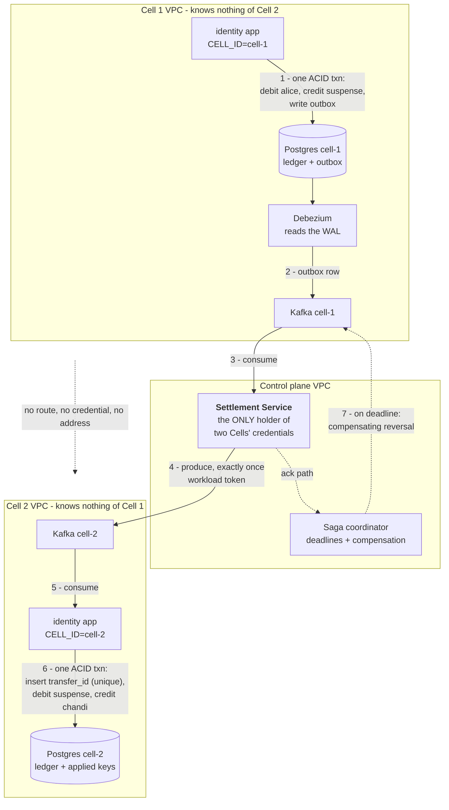

# Cross-Cell settlement

**Status: designed, not built.** `docs/adr/0001` records cross-Cell transfer as an accepted cost of
Cell isolation. This is the mechanism that pays that cost, drawn so it can be explained in two minutes.

Nothing in this document is claimed as implemented. What exists today is stated in section 5.

## 1. The constraint that shapes everything

Two independent databases with no shared transaction manager cannot be both strongly consistent and
available under partition. That is CAP, and it is a theorem rather than a preference.

An atomic cross-Cell transfer would need a coordinator holding locks in both Cells, which is shared
fate, which is the exact property Cells exist to remove. **So the answer is not a distributed
transaction. It is settlement**, the way interbank payment rails have always worked.

We place the CAP tradeoff deliberately, at the Cell boundary:

| Scope | Guarantee |
|---|---|
| Inside a Cell | Strictly serializable. One Postgres, one ACID transaction |
| Across Cells | Bounded eventual settlement, with monetary invariants that hold at every instant |

## 2. Topology

One Kafka cluster per Cell. **Never a shared one**: a broker both Cells authenticate to is a shared
trust domain and a shared failure domain, which is the 2065 architecture reintroduced as
infrastructure.

The dotted line between the Cells is the point of the diagram. It is the only relationship they have
and it is an absence.

## 3. The flow

```mermaid
sequenceDiagram
    autonumber
    participant A as Alice (Cell 1)
    participant C1 as Cell 1 Postgres
    participant S as Settlement Service
    participant C2 as Cell 2 Postgres
    participant CH as Chandi (Cell 2)

    A->>C1: pay chandi 1000
    Note over C1: ONE transaction:<br/>debit alice 1000<br/>credit suspense:outbound:cell-2 1000<br/>insert outbox row T
    C1-->>A: accepted, pending
    Note over A,C1: the customer request is COMPLETE here.<br/>nothing downstream can fail her write

    C1->>S: outbox row T, via Debezium and Cell 1's Kafka
    S->>C2: credit chandi 1000, transfer T
    Note over C2: ONE transaction:<br/>insert settlement_applied(T) - unique<br/>debit suspense:inbound:cell-1 1000<br/>credit chandi 1000
    C2-->>CH: funds available
    C2-->>S: ack T
    S-->>C1: settled T

    rect rgb(60, 30, 30)
    Note over S,C2: FAILURE PATH: Cell 2 down, quarantined, or slow
    S->>S: retry with backoff, messages retained in Kafka
    Note over S: deadline exceeded
    S->>C1: compensate T
    Note over C1: debit suspense, credit alice.<br/>its own hash chained block.<br/>nothing is erased
    C1-->>A: returned
    end
```

## 4. Why each property holds

**Availability.** Trace the customer path: it touches Cell 1's Postgres and nothing else. Kafka, the
Settlement Service and Cell 2 can all be down and Alice's payment still succeeds. It settles later or
it reverses. There is no synchronous cross-Cell dependency in any write path.

**No dual write.** The ledger block and the outbox row commit in the same transaction. There is no
window where one exists without the other. Debezium reads the write-ahead log, so a crash between
commit and publish loses nothing.

**Exactly once.** Kafka's transactional producer gives exactly-once between the two clusters, but that
does not extend into an external database. So Postgres is the idempotency authority: a unique
`transfer_id` in `settlement_applied`, inserted in the same transaction as the credit. Replay conflicts
and aborts. The Kafka offset is committed only after that transaction succeeds.

**Conservation.** Every step is a balanced double-entry append. At every instant, money is either in a
customer account or in a suspense account. It is never in flight in the sense of not existing.

**Isolation.** Cell 1 publishes to its own Kafka. It holds no address, credential or topic for Cell 2.
The Settlement Service crosses, with its own identity. Cell 2's inbound surface is one message shape:
credit this account, this amount, this transfer id. No reads, no queries, no enumeration.

**Against a compromised Cell.** A Cell that is fully owned can publish fabricated settlement messages
to its own topic. Three things bound it: the Settlement Service verifies the referenced ledger block
exists in that Cell's chain, verifies against the chain, and debits a real customer into the outbound
suspense for exactly that amount and transfer id; per-Cell settlement value and rate caps; and
continuous reconciliation.

**Reconciliation.** `sum(suspense:outbound:cell-2)` in Cell 1 must equal
`sum(suspense:inbound:cell-1)` in Cell 2, plus legitimate in-flight. Any drift raises an alarm. This is
nostro and vostro reconciliation, unchanged from how interbank settlement has always worked.

## 5. What exists today, precisely

| Piece | State |
|---|---|
| Transactional outbox | **Built.** `packages/events`, outbox written in the same transaction as the state change |
| Idempotency keyed on a request id | **Built.** Proven under five concurrent duplicate requests |
| Hash chained ledger, balanced double entry | **Built.** `packages/ledger-core` |
| Workload identity for service to service calls | **Built.** `packages/workload-auth` |
| Event backbone | **Redis Streams.** Kafka is the documented target, `docs/adr/0004` |
| Suspense accounts, Settlement Service, saga coordinator, reconciliation | **Not built.** This document is the design |

A cross-Cell transfer attempted today returns `404 ACCOUNT_NOT_FOUND`. The payee must live in the same
Cell. That is the honest current state and it should be stated plainly rather than demonstrated
accidentally.

## 6. The two minute answer

> Inside a Cell we are strictly serializable. Across Cells we are bounded eventually consistent,
> because CAP says we cannot be atomic and available across a partition, and availability is the thing
> a bank cannot trade. So we do what interbank settlement does. Suspense accounts on both sides. A
> transactional outbox so the debit and the intent commit together. Change data capture into that
> Cell's own Kafka. A settlement service that is the only holder of two Cells' credentials. Exactly
> once via idempotency in the destination database. Compensation on a deadline. Continuous
> reconciliation. Money is never created or destroyed at any instant, and no Cell ever waits on
> another to serve its own customers.
