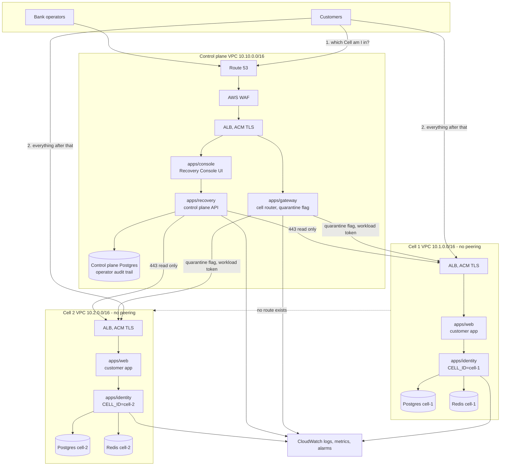

# Phase 3 deployment architecture

Target architecture for Arka on AWS, and the increment of it that is provisioned for the Fortify day
on 6 August 2026.

## How to read this document

Two things are described here and they must never be confused with each other.

**The target** is the production shape of Arka on AWS. It is what the Phase 1 blueprint describes and
it is what section 3.4 of the submission scales.

**Tier 0** is what is actually provisioned and running. Every Tier 0 resource is real, reachable, and
created by Terraform. Everything above Tier 0 is a documented next increment with a named reason for
not being built yet, not an aspiration.

A judge asking "is this deployed?" gets a URL. A judge asking "is this the whole architecture?" gets
this document and an honest answer. Nothing in the demo depends on a resource that does not exist.

---

## 1. The organising principle

Arka's central claim, from `docs/adr/0001`, is that a compromise of one Cell cannot reach another. On
a laptop that claim is enforced by separate Docker networks. On AWS it is enforced one level lower and
far more convincingly.

**One VPC per Cell. No peering connection, no transit gateway, no shared subnet, no shared security
group.** Cell 1 and Cell 2 do not merely lack a route to each other, there is no AWS object anywhere
in the account that could carry traffic between them. This is stronger than subnet isolation inside a
shared VPC, which is what a conventional three-tier AWS diagram would give you, because subnet
isolation is a security group rule away from being wrong and VPC isolation is not.

That raises the obvious question: if the Cells are unreachable, how does the Gateway reach them?

**Over the public internet, with TLS, authenticated by a short-lived workload token, restricted by
security group to exactly one source address.** Each Cell's host allows inbound 443 from the control
plane's Elastic IP and from nothing else. `packages/workload-auth` already issues and verifies the
tokens, so this is the design the code was written for rather than a deployment workaround.

The consequence is worth stating plainly because it is the thing to say to the panel: the Gateway holds
a credential for each Cell, and each Cell trusts only the Gateway. A Cell holds no credential for
another Cell and has no address for one. Compromising a Cell yields the customers in that Cell and
nothing else, which is exactly the blast radius the blueprint promised.

---

## 2. Target architecture



The dotted line is the point of the diagram. It is the only relationship between the two Cells and it
is an absence.

### Component ownership

| Component | Instances | Owns |
|---|---|---|
| `apps/web` | **1 per Cell** | Customer screens W1 to W4. Lives in the Cell because `NEXT_PUBLIC_IDENTITY_API_URL` is fixed at build time, so one build addresses exactly one Cell. Putting it in the Cell turns that constraint into the correct topology instead of a workaround |
| `apps/console` | 1, control plane | Recovery Console screens W5, W6 |
| `apps/gateway` | 1, control plane | Customer to Cell routing by stable hash, per-Cell quarantine flag. The only component aware that more than one Cell exists |
| `apps/recovery` | 1, control plane | Cell health observation, dual-approval quarantine, audit trail |
| `apps/identity` | **1 per Cell** | The whole Cell service stack composed into one deployable, per `docs/adr/0006` |
| Postgres | 1 per Cell, plus 1 control plane | Cell databases hold customer data. The control plane database holds operator actions only, never customer data |
| Redis | 1 per Cell | Event streams, per `docs/adr/0004` |

---

## 3. Tier 0, provisioned for 6 August

Three EC2 hosts in `ap-south-1` (Mumbai), each in its own VPC, each running the relevant part of the
stack under Docker Compose behind Caddy for automatic TLS.

| Host | VPC | Type | Runs | Public name |
|---|---|---|---|---|
| `arka-control` | 10.10.0.0/16 | t2.medium | console, gateway, recovery, control Postgres | `arka.<eip>.nip.io` |
| `arka-cell-1` | 10.1.0.0/16 | t2.small | web, identity (CELL_ID=cell-1), Postgres, Redis | `cell-1.<eip>.nip.io` |
| `arka-cell-2` | 10.2.0.0/16 | t2.small | web, identity (CELL_ID=cell-2), Postgres, Redis | `cell-2.<eip>.nip.io` |

Sizing note. The blueprint sizing was `t3.medium` everywhere. This account's EC2 vCPU quota is **5**,
and three `t3.medium` at 2 vCPU each needs 6. So control takes `t2.medium` at 2 vCPU and each Cell
takes `t2.small` at 1 vCPU, which is 4 vCPU with two Cells and exactly 5 once Cell 3 joins. Reasoning
in `infra/terraform/README.md`.

The consequence is 2 GiB on a Cell host, which runs the stack but does not build it: `next build`
peaks above that and gets OOM-killed with an error that looks like anything but memory. `deploy/build.sh`
provisions 4G of swap before building on any host under 4 GiB.

The containment demonstration becomes two browser tabs, `cell-1.<eip>.nip.io` and
`cell-2.<eip>.nip.io`, signed in as `alice` and `chandi` respectively. Quarantine Cell 1 from the
console and watch one tab lose the ability to move money while the other carries on. That is runbook
P2's "how you know it worked" performed in front of the panel with nothing hidden offscreen.

`nip.io` resolves `anything.1.2.3.4.nip.io` to `1.2.3.4`, which lets Caddy obtain a real Let's Encrypt
certificate without owning a domain. Public CA, valid TLS, zero DNS setup, no cost.

### Security groups

| Group | Inbound | From |
|---|---|---|
| `arka-control-sg` | 80, 443 | 0.0.0.0/0 |
| | 22 | operator IP only |
| `arka-cell-N-sg` | 80, 443 | 0.0.0.0/0. Customers browse their own Cell directly |
| | 22 | operator IP only |
| | 5432, 6379 | **nothing. No rule exists** |

Postgres and Redis are bound to the Cell's internal Docker network and are never published to the
host, so there is no listener for a security group rule to permit or deny. This matters for how the
isolation claim is worded, below.

### Stating the isolation claim accurately

Because customers reach their own Cell over the public internet, Cell 1's host can send an HTTP request
to Cell 2's public address. So can any laptop on earth. Reachability of a public web port is not the
claim and pretending otherwise would not survive the Verification section of the rulebook.

The claim is narrower and stronger: **a compromise of Cell 1 yields no credential, no key, and no
network position that grants access to Cell 2's data.** Three things demonstrate it, and all three are
true:

1. **Data layer.** From the Cell 1 host, `psql` to Cell 2's database fails to connect. No public
   listener exists, and no route into Cell 2's VPC exists to reach the private one.
2. **Credential layer.** Dump Cell 1's container environment. It contains no Cell 2 database URL, no
   Cell 2 signing key, no Cell 2 workload token. Ten seconds, and the most persuasive of the three.
3. **Application layer.** From the Cell 1 host, call Cell 2's API. It answers, exactly as it answers
   any stranger, with 401. Holding an address is not holding access.

### What Tier 0 substitutes, and why

| Target | Tier 0 | Reason |
|---|---|---|
| ECS Fargate | Docker Compose on EC2 | Same container images, same env-var contract. Fargate is a change of scheduler, not of application |
| RDS Multi-AZ Postgres | Postgres container with a volume | **This one is a deliberate demo decision, not a shortcut.** Runbook P3 rebuilds a Cell live in front of the panel. A containerised Postgres rebuilds in seconds. RDS takes 15 to 20 minutes to provision, which does not fit inside a live demonstration |
| ElastiCache Redis | Redis container | Same reason as above |
| ALB per VPC | Caddy on the host | An ALB adds cost and roughly 4 minutes to provision, and terminates TLS identically for one target |
| WAF, CloudFront | Not present | Nothing in Tier 0 serves at a scale where they change behaviour. Adding them would make the diagram look better and the system no safer |

The RDS row is worth rehearsing as a spoken answer. "We run Postgres in a container because the
demonstration you are about to watch rebuilds a Cell from infrastructure code in under four minutes,
and RDS provisioning alone is fifteen" is a stronger answer than having RDS and not being able to show
a rebuild.

---

## 4. The Terraform module contract

One module, `infra/terraform/modules/cell/`, instantiated once per Cell. Copying a tfvars file is the
entire cost of adding a Cell. This is the claim in section 3.4 of the submission, made executable.

```
infra/terraform/
├── modules/
│   ├── cell/            one Cell: VPC, subnet, IGW, SG, EIP, EC2, cloud-init
│   └── control/         control plane: VPC, subnet, IGW, SG, EIP, EC2
├── main.tf              instantiates control once, cell once per tfvars
├── variables.tf
├── outputs.tf
└── cells/
    ├── cell-1.tfvars
    ├── cell-2.tfvars
    └── cell-3.tfvars    written tonight, NOT applied tonight
```

### `modules/cell` interface

Inputs:

| Variable | Example | Notes |
|---|---|---|
| `cell_id` | `cell-1` | Becomes `CELL_ID` in the container environment |
| `vpc_cidr` | `10.1.0.0/16` | Must not overlap another Cell, though nothing routes between them anyway |
| `instance_type` | `t2.small` | |
| `control_plane_ip` | `13.x.x.x/32` | The only address permitted inbound on 443 |
| `operator_ip` | `x.x.x.x/32` | The only address permitted inbound on 22 |
| `key_name` | `arka-phase3` | |

Outputs: `public_ip`, `hostname`, `cell_id`.

**The module must contain no conditional on `cell_id`.** If a Cell needs a special case in
infrastructure, ADR 0001 has been violated and the defect is in the services, not the Terraform. This
is the follow-through clause `docs/adr/0005` already committed to.

### Ordering

The control plane Elastic IP must exist before the Cell security groups can reference it, so allocate
`aws_eip.control` first and pass it into both Cell module instances. Terraform resolves this from the
dependency graph automatically as long as the EIP is a separate resource from the instance it attaches
to.

### The live moment

`cells/cell-3.tfvars` is written tonight and deliberately not applied. In the deployment window
tomorrow morning, in front of the panel:

```bash
terraform apply -var-file=cells/cell-3.tfvars
```

A third Cell appears with its own VPC, its own database, its own signing key, and no route to the
other two. The Recovery Console health map picks it up. That is section 3.4 performed rather than
described, and it costs one command.

---

## 5. Verification plan

Runs after the deployment is live, against Arka's own infrastructure only.

### Isolation, the claim that matters most

The three checks from section 3, run and captured as evidence:

1. From the Cell 1 host, `psql` to Cell 2's database. Must fail to connect.
2. Dump the Cell 1 container environment. Must contain no Cell 2 credential, key, or database URL.
3. From the Cell 1 host, call Cell 2's API without a workload token. Must return 401.

Capture the terminal output of all three tonight. Evidence gathered calmly beats evidence gathered
while a judge watches.

### Security

| Check | Tool | Pass condition |
|---|---|---|
| TLS configuration and cipher grade | `testssl.sh` or SSL Labs | A or better, TLS 1.2 minimum |
| Security headers | `curl -I` | HSTS, X-Content-Type-Options, frame options present |
| Common web vulnerabilities | `nuclei` | No high or critical |
| Injection on every input | `sqlmap` against the seeded demo account | No injection. All queries are parameterised via `pg` |
| Authentication bypass | Manual, plus replay of a captured session | Step-up auth holds |
| Rate limiting | `hey` or a shell loop against sign-in | `PgRateLimiter` engages and returns 429 |
| Idempotency under replay | Fire the same `Idempotency-Key` 50 times concurrently | Money moves exactly once. Verify with `pnpm verify-ledger` |
| Secret exposure | `gitleaks` over the repo, plus reading the deployed environment | No key material in the image or the repo |
| Quarantine cannot be bypassed | Write against a quarantined Cell directly, skipping the Gateway | Rejected read-only. Reads still succeed |

The idempotency and quarantine rows are the interesting ones. Every team will have TLS. Very few will
be able to fire fifty concurrent duplicate payments and then walk a hash chain to prove the money moved
once.

### Load

`k6` or `autocannon` against the Gateway, ramping to the point where the rate limiter engages. Rate
limiting, not anomaly detection: there is no anomaly service, it is deferred and `docs/ARCHITECTURE.md`
says so. Do not let the demo narration promote one into the other.
The result to capture is not a throughput number, it is the behaviour: load against Cell 1 must leave
Cell 2's latency unchanged. Record both series on the same time axis. Isolation under load is a
different and better claim than isolation at rest.

Do not publish a throughput figure that has not been measured on this exact deployment. An unsourced
number is the one thing the Verification section of the rulebook is written to catch.

---

## 6. Risks

| Risk | Impact | Mitigation |
|---|---|---|
| **EC2 vCPU quota.** Three t3 instances is 6 vCPU. A new AWS account's default on-demand standard quota is often 5 | Blocks everything | Check `Service Quotas > EC2 > Running On-Demand Standard instances` before writing any Terraform. Raising it is a support ticket measured in hours |
| Native module `@node-rs/argon2` built for the wrong platform | Identity app crashes on boot | Build the images on the Linux host, never on Windows. `.dockerignore` must exclude `node_modules` |
| Venue network blocks outbound 443 or SSH | Cannot reach the deployment | The local Compose stack remains the rehearsed fallback. Capture a screen recording of the full runbook sequence tonight as a third line of defence |
| Let's Encrypt rate limit during repeated redeploys | TLS fails on the day | Use Caddy's staging issuer while iterating, switch to production once |
| Terraform state on one laptop | Only one person can apply | Local state is acceptable for a one-day competition. Commit nothing containing state or keys |

---

## 7. Out of scope, stated so it is not mistaken for an oversight

Multi-AZ, autoscaling, CloudFront, WAF, VPC endpoints, NAT gateways, Secrets Manager, and RDS are all
absent from Tier 0. Each is a resource block in a module that already has the right shape. None of them
changes the behaviour a judge can observe tomorrow, and each one adds provisioning time and a failure
mode to a system that has to work in a seven hour window.

The reasoning follows `docs/adr/0005` exactly: deferring is scheduling, not scope reduction.
